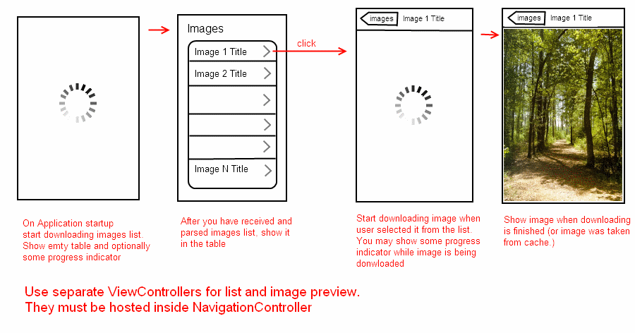

# Images
Swift 2.0, Xcode 7, iOS 9

Application which downloads list of images, shows that list, and allows to 
download and preview selected image.


**Workflow is the following:**




**Technical details:**

1. Images list format. Format of the images list file is XML. It has the following structure:

```xml
    <?xml version="1.0" encoding="UTF-8"?>
    <images>
        <image title="Image 1 Title" src="URL of Image 1"/>
        <image title="Image 2 Title" src="URL of Image 2"/>
        . . .
        <image title="Image N Title" src="URL of Image N"/>
    </images>
```
2. This list is stored at https://dl.dropboxusercontent.com/u/73337349/testtask/images.xml
3. Images are located at URLs which are values of "src" attributes of "image" nodes.


**Obligatory Requirements:**

1. Third party libraries should not be used.
    (Actually, it is easy to implement all this functionality only using native iPhone Cocoa and Foundation classes).
2. Application should not hang/freeze during download operations. Everything should be performed asynchronously.
3. Application should not crash if some errors happen (e.g. internet connection is broken, XML images list is invalid, invalid URL, and so on).

**Additional Requirements:**

1. It is preferred to cache images somewhere (e.g. on memory-card as files) in order to minimize internet traffic.
2. Application may show some progress indicator (progress bar, rotating lines, etc.) during data downloading processes.
3. Image preview should have possibility to zoom images (it easy to achieve this even with standard controls).
4. Application should work in both, portrait and landscape modes.
5. Application functionality should be divided into separate reusable classes (downloading, caching).
